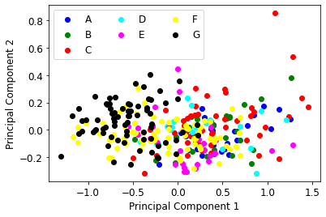

# ML-Contests-Infrared-spectrum-classification
Classify solid samples according to their diffuse reflectance infrared spectra


The Near Infrared Spectroscopy Branch of the China Instrument Society holds the [data modeling contest](https://www.instrument.com.cn/news/20220725/625062.shtml) (2022 创和亿杯近红外光谱数据建模竞赛). The organizer provides [a set of near-infrared spectral data](https://img1.17img.cn/17img/files/202207/attachment/d3666a14-5a77-4d56-b183-49d07239349f.rar) from the actual application scenario. Different data preprocessing technologies (e.g. PCA, normalization) and machine learning models ([AutoGluon](https://auto.gluon.ai/stable/index.html)) were tried for the classification problem. [ExtraTreesClassifier](https://scikit-learn.org/stable/modules/generated/sklearn.ensemble.ExtraTreesClassifier.html) was used as the final model. <br /><br />
***Our work won an [excellent award](https://www.instrument.com.cn/news/20220824/629168.shtml) in this competition.***

## Dataset introduction:
|  Dataset  | Input  | Output |
| :------------ |:---------------:| ---------------:|
| Training Set | 301 samples x 700 features | 301 samples x 1 (of 7 categories) |
| Testing Set | 76 samples x 700 features   |  76 samples x 1 (of 7 categories)* |

\* Need to be classified for competition evaluation

## Installation
The project was implemented in Colab with python 3.7

```bash
!pip install --upgrade mxnet
!pip install autogluon
```
